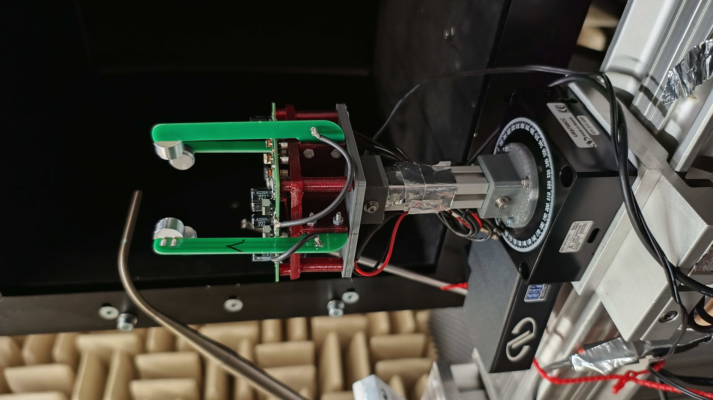
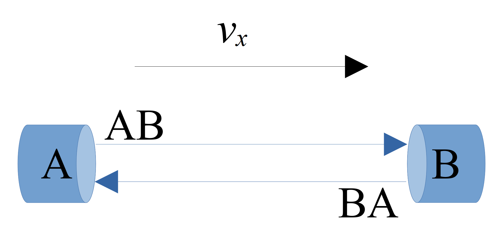
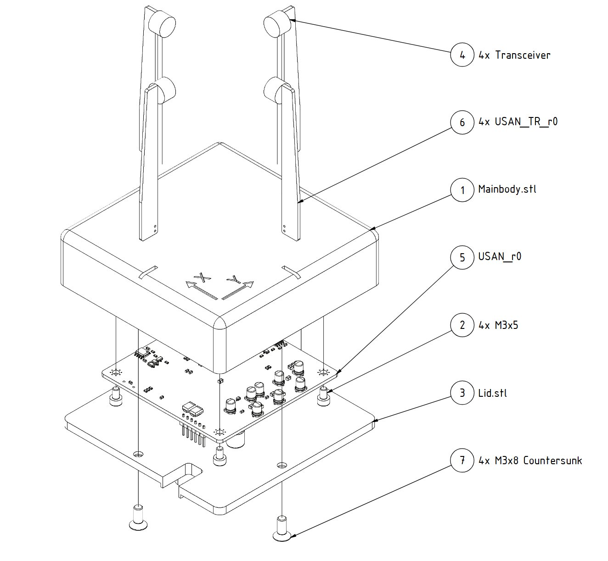
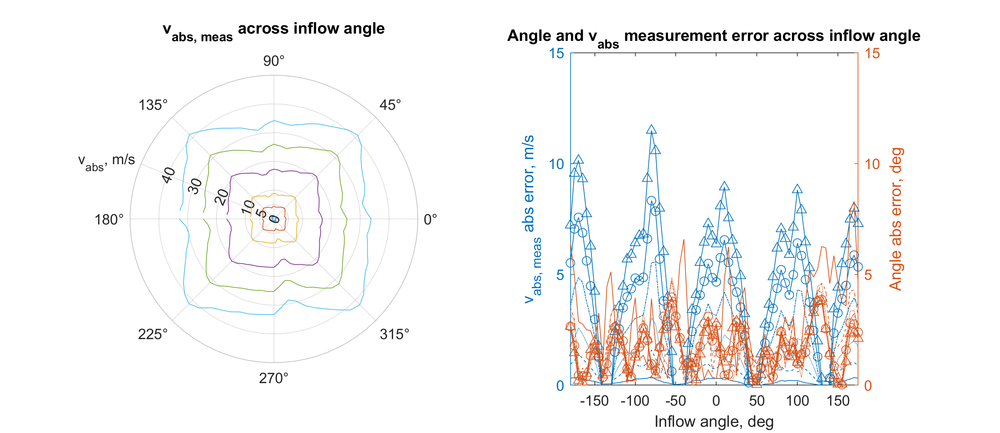
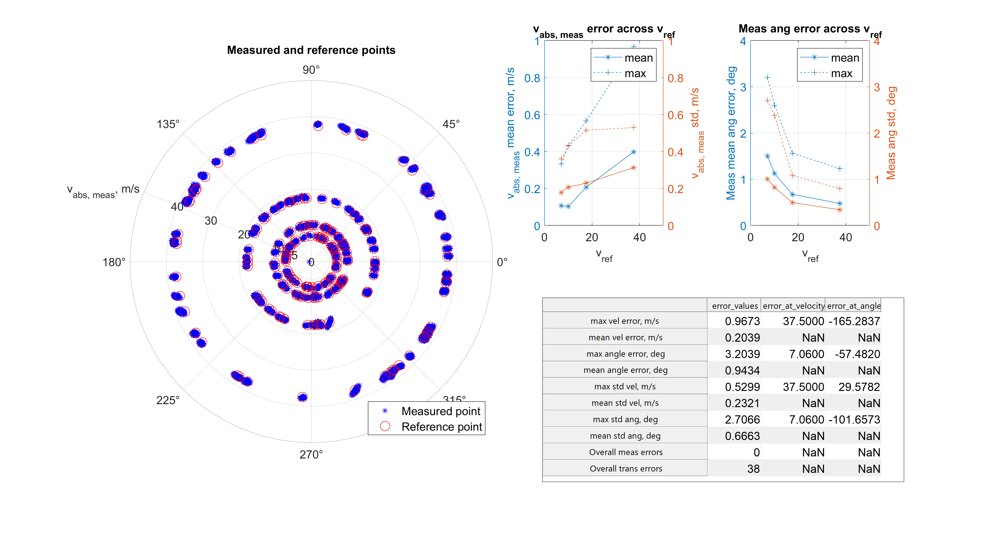

## Summary

1. Overview
2. Build instructions
3. Testing and validation 

## 1. Overview

The goal of this project was to create a low cost small scale 2D ultrasonic anenomter. The resulting solution is based on a STM32F4 microcontroller and uses off the shelf electrical components with a cost of around 100€, and offers multiple IO options for data output, a USB interface, a dual-channel analog output, and a synchronization signal input. The sensor can be configured with various parameters and a maximum measurement frequency of 100 Hz can be achieved.
A detailed explanation of the working principle and the technique used can be found in my [thesis]("Documentation/Bachelor_thesis.pdf"). 

So this explanation will be brief:

The speed of sound and the airspeed are calculated with the help of two ultrasound transmissions in opposite directions, the mean measured speed for both transmissions is the speed of sound and the difference to the mean is the airspeed.

To accurately calculate the speed of the transmissions, the time of flight (ToF) between transmission and reception must be accurately measured, which requires some neat digital signal processing. An interactive MATLAB script (or PDF) with a step-by-step explanation and visualization can be found here. 
The sensor can be used and configured via serial terminal, all commands and expected behaviour are given in the manual.

## 2. Build instructions
### Hardware
KiCad has been used for the PCB design, the design files and a production-ready export can be found in the Hardware folder.
The PCB can be manufactured by most common PCB manufacturing services such as JLCPCB or Aisler. There are two different types of PCB, a two layer PCB for mounting the transceivers and a four layer PCB for the main board. All components can be soldered by hand, although reflow soldering (using a hot plate or hot air) is highly recommended.
Most components are available from Mouser. The resistors should be 1% accurate and the ceramic capacitors should have a minimum nominal voltage rating of 24V.

The other part of the hardware consists of 3D printed parts and M3 screws.
The arms are glued into the body to create a watertight connection, an epoxy glue should be used. 

### Software
The software devlopment was done in Segger embeded studio the files can be found in the Software folder.
Further configuartion parameters can be set in the sensor_config.h file.
This makes it possible to change the transceiver or to modify the geometry of the sensor.

Using the USB interface, different runmodes an trigger/sample times can be configured, for more information look in to the [manual](https://github.com/alu-source/open-USAN/blob/main/Documentation/Manual/Ultrasonic%20Anemometer%20Reference%20Manual.docx).

## 3. Testing and Validation

Testing and validation was carried out in a wind tunnel capable of generating air speeds of up to 45 m/s.
A prantle tube and a Dantec high pression anemometer were used for velocity measurements.

In the first test, a velocity deficit was detected near the transceiver mounting location due to transceiver blockage, as shown below. 

The left plot shows the measured velocity magnetude and the right plot shows the measurement error of magnitude and angle over the inflow angle. 

In order to counteract this phenomenon, calibration was carried out at various inflow angle and air speeds. 
Each sensor has a slightly different optimum calibration, the data includes an averaged calibration for the sensor which does not give the best sensor performance but eliminates the need to perform a calibration.
A semi-automated [skript] ("/2D-US-Calibration/Skript/Sensor_calibration_and_validation.m") was developed and tested to collect the raw data required for calibration. After calibration, a validation measurement was performed. 

